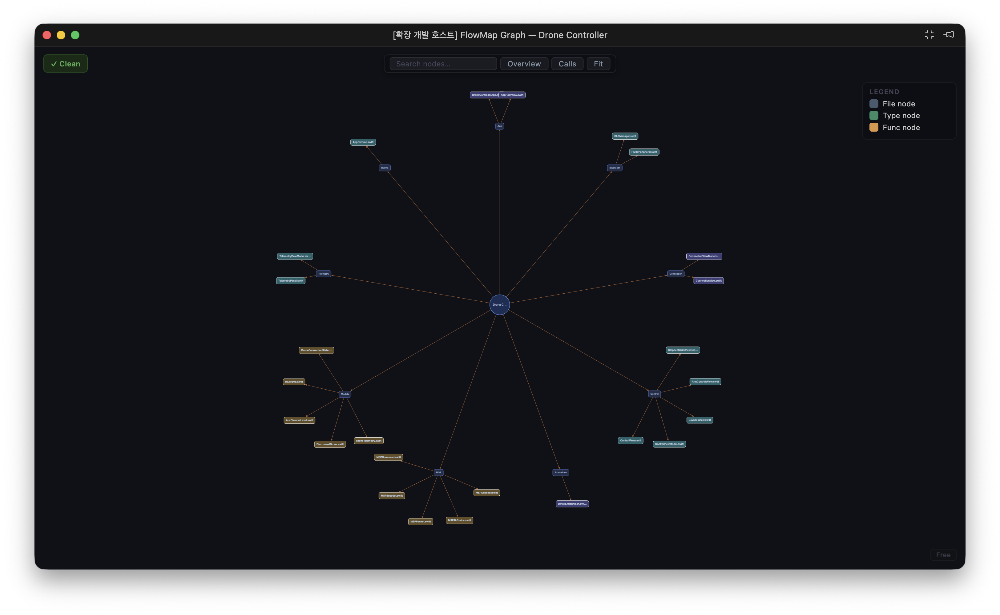
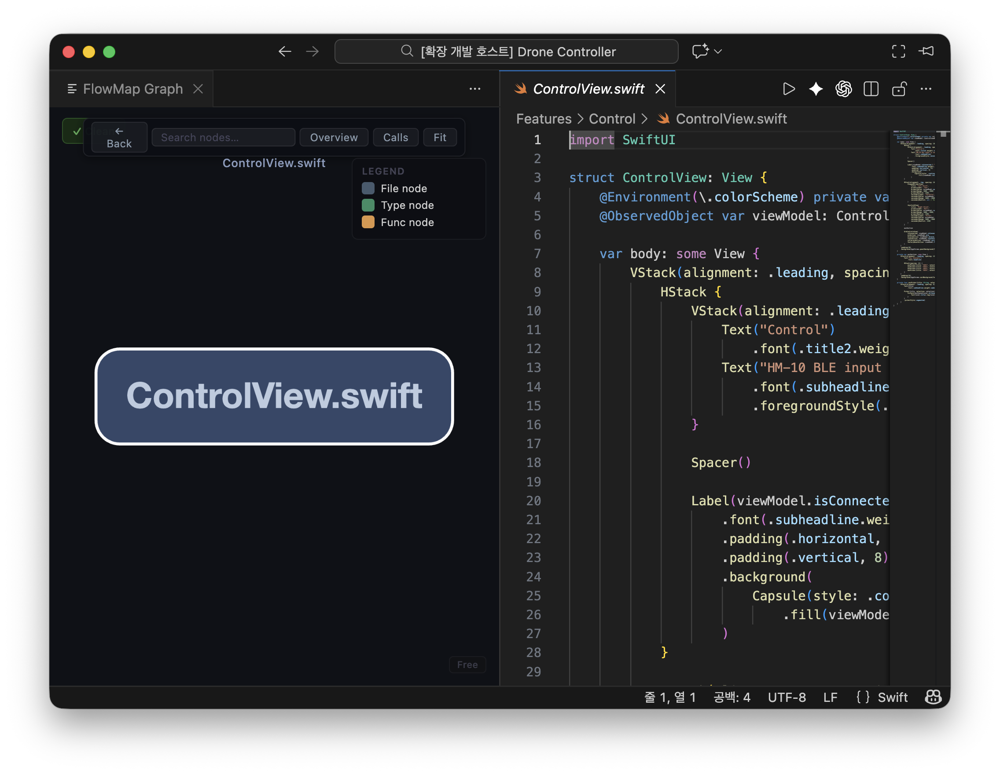
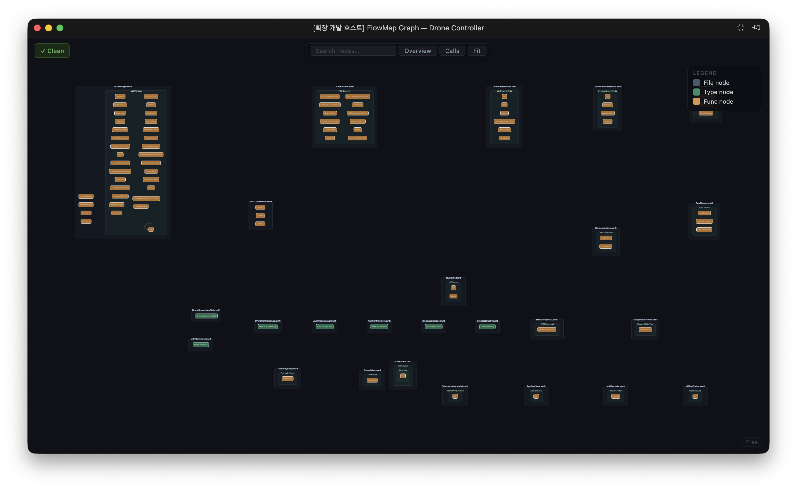

# FlowMap

> Swift 코드의 구조와 호출 관계를 그래프로 분석하는 도구입니다. AI가 생성한 코드 변경을 검증할 때 특히 유용합니다.

[English](README.md) · [日本語](README.ja.md)

## FlowMap이란?

FlowMap은 Swift 코드를 파싱해 파일, 타입, 함수, 호출 관계를 워크스페이스 단위로 그래프화하고, VS Code에서 시각적으로 탐색할 수 있게 해주는 개발 도구입니다.

이런 질문에 답해야 할 때 유용합니다.

- 이 함수는 실제로 어디서 호출되는가?
- 이 파일을 바꾸면 어디까지 영향이 가는가?
- AI가 생성한 코드가 겉보기엔 그럴듯하지만 실제 구조는 맞는가?
- 이 프로젝트의 전체 모양이 어떻게 생겼는가?

FlowMap은 컴파일러 대체제가 아닙니다. 실제 코드 관계를 눈으로 볼 수 있게 해주는 실용적인 워크스페이스 수준 분석 도구입니다.

## 이런 분께 유용합니다

- AI 보조 코딩 도구를 활용하면서 실제로 무엇이 바뀌었는지 검증하고 싶은 개발자
- 낯선 Swift 코드베이스를 리뷰하는 엔지니어
- 빌드 없이 Swift 프로젝트의 전체 구조를 파악하고 싶은 분

## 현재 기능

- SwiftSyntax 기반 Swift AST 파싱
- 파일 / 타입 / 함수 그래프 생성
- 파일 내 호출 + 보수적인 워크스페이스 단위 cross-file 호출 연결
- 변경 파일 기반 그래프 diff
- 호출 엣지 기반 영향 범위 분석
- VS Code 시각화 3가지 모드:
  - **Overview** — 프로젝트 / 폴더 / 파일 구조
  - **File Detail** — 파일 내 타입·함수 상세 탐색
  - **Calls** — 호출 군집 탐색
- 저장 시 자동 재분석

## 스크린샷

### Overview 모드



### File Detail 모드



### Calls 모드



## 데모


## 설치

### 준비물

- macOS (Swift 파서 실행에 필요)
- Rust toolchain ([rustup.rs](https://rustup.rs))
- Swift toolchain / Xcode command line tools
- Node.js v20 이상
- VS Code

### 빌드

**1. 레포 클론**

```bash
git clone https://github.com/adgk2349/FlowMap.git
cd FlowMap
```

**2. Rust 엔진 빌드**

```bash
cargo build
```

**3. Swift 파서 빌드**

```bash
cd parsers/swift-ast
swift build -c release
cd ../..
```

**4. VS Code 확장 컴파일**

```bash
cd editor/vscode
npm install
npm run compile
cd ../..
```

### VS Code에서 실행

1. `editor/vscode` 폴더를 VS Code로 엽니다
2. `F5`를 눌러 Extension Development Host를 실행합니다
3. 새로 열린 VS Code 창에서 Swift 워크스페이스를 엽니다
4. 커맨드 팔레트에서 **FlowMap: Analyze Workspace**를 실행합니다 (`Cmd+Shift+P`)
5. **FlowMap Graph** 패널을 엽니다

## 사용 방법

1. VS Code에서 Swift 워크스페이스를 엽니다
2. 커맨드 팔레트에서 **FlowMap: Analyze Workspace**를 실행합니다
3. 그래프를 탐색합니다:
   - **Overview** — 프로젝트 전체 구조를 한눈에 파악
   - **File Detail** — 파일 클릭으로 타입·함수 상세 탐색
   - **Calls** — 호출 군집과 함수 연결 흐름 추적
4. 파일을 저장하면 자동으로 재분석됩니다

## 라이선스

FlowMap은 source-available 방식으로 제공됩니다.

**Swift 지원**
- 개인 및 비상업적 사용: 무료
- 상업적 / 팀 / 기업 사용: 라이선스 필요

**추가 언어**
향후 추가 언어 지원은 별도 상용 플러그인 형태로 제공될 수 있습니다.

상업적 사용 문의: *(연락처를 여기에 추가하세요)*

## 로드맵

- Swift 호출 해석 정확도 향상
- extension, 프로토콜 등 cross-file 케이스 강화
- 추가 언어 지원
- diff / impact 시각화 개선
- export / 공유 기능 강화

## 기여

이슈와 PR은 환영합니다.

기여하기 좋은 영역:

- Swift 파싱 edge case
- 호출 해석 개선
- 그래프 레이아웃 / 시각화 개선
- 문서화
- VS Code UX 개선

## 상태

FlowMap은 빠르게 발전 중입니다. 현재 버전은 완성된 플랫폼이 아닌 초기 단계 도구입니다. 피드백과 기여를 환영합니다.
