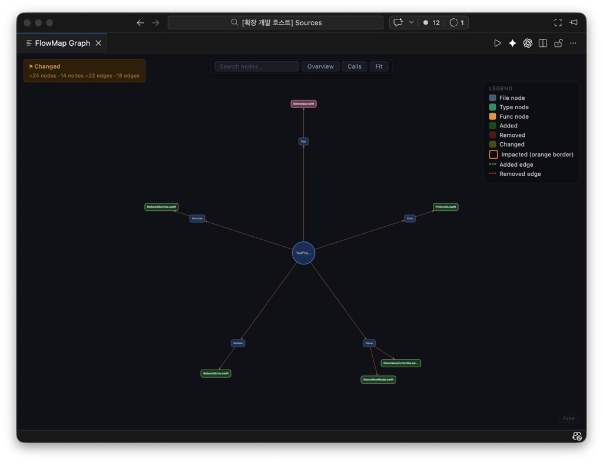
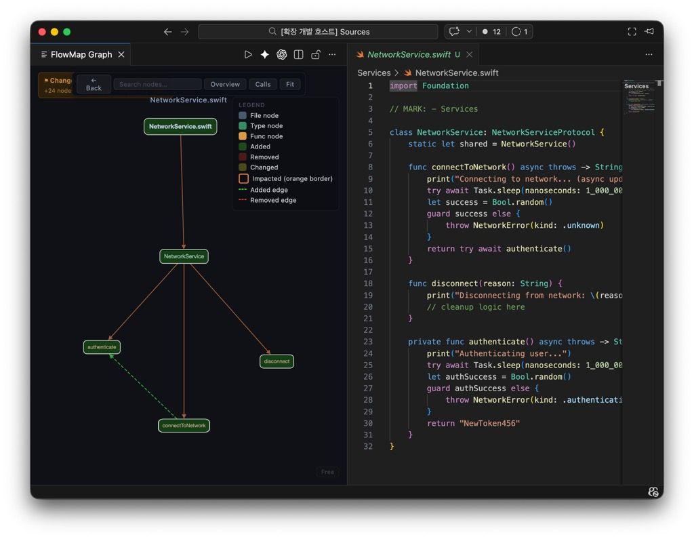
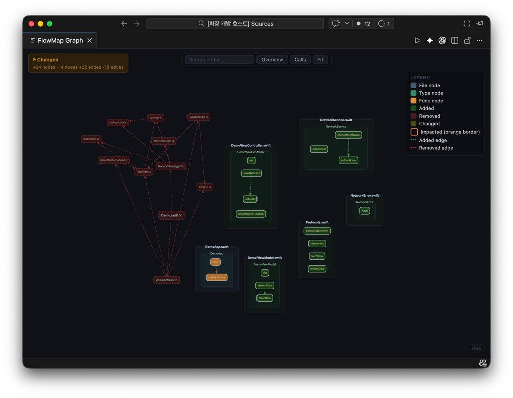

> **PUBLIC BETA NOTICE (March 8, 2026):** FlowMap is in public beta. Licensing is currently local/dev-only preview (no production server-side entitlement enforcement yet).

# FlowMap

> Swift code graph and impact analysis tool — understand and verify code structure, especially when reviewing AI-generated changes.

[](https://github.com/adgk2349/FlowMap/actions/workflows/ci.yml)

[한국어](README.ko.md) · [日本語](README.ja.md)

## What is FlowMap?

FlowMap parses Swift code, builds a workspace-level graph of files, types, functions, and call relationships, and visualizes that graph inside VS Code.

It answers questions like:

- What actually calls this function?
- What breaks if I change this file?
- Is this AI-generated code structurally sound, or just plausible-looking?
- What is the overall shape of this project?

FlowMap is not a compiler replacement. It makes real code structure visible at the workspace level so you can verify relationships directly rather than inferring them.

## Who it is for

- Developers using AI-assisted coding tools who want to verify what actually changed
- Engineers reviewing unfamiliar Swift codebases
- Anyone who wants a structural view of a Swift project without requiring a full build

## Current features

- Swift AST parsing via SwiftSyntax
- File / type / function graph generation
- Same-file and conservative cross-file call linking
- Graph diff for changed files
- Impact analysis over call edges
- VS Code visualization with three modes:
  - **Overview** — project / folder / file structure
  - **File Detail** — type and function drill-down within a file
  - **Calls** — call-cluster exploration across the workspace
- Auto-analyze on save

## Screenshots

### Overview mode



### File detail mode



### Calls mode



## Installation

### Prerequisites

- macOS (required for the Swift parser)
- Rust toolchain ([rustup.rs](https://rustup.rs))
- Swift toolchain / Xcode command line tools
- Node.js v20 or later
- VS Code

### Build

**1. Clone the repository**

```bash
git clone https://github.com/adgk2349/FlowMap.git
cd FlowMap
```

**2. Build the Rust engine**

```bash
cargo build
```

**3. Build the Swift parser**

```bash
cd parsers/swift-ast
swift build -c release
cd ../..
```

> Note: replay/scenario validation scripts look for the parser binary at `parsers/swift-ast/.build/debug/flowmap-swift-ast`.  
> If you run those scripts, also build debug once: `cd parsers/swift-ast && swift build -c debug`.

**4. Compile the VS Code extension**

```bash
cd editor/vscode
npm install
npm run compile
cd ../..
```

### Run in VS Code

1. Open the `editor/vscode` folder in VS Code
2. Press `F5` to launch the Extension Development Host
3. In the new VS Code window, open a Swift workspace
4. Run **FlowMap: Analyze Workspace** from the command palette (`Cmd+Shift+P`)
5. Open the **FlowMap Graph** panel

### Run from VSIX (installed extension)

If you install FlowMap via `.vsix`, set `flowmap.binaryPath` to your built engine binary path (for example: `/path/to/FlowMap/target/debug/flowmap`), then run **FlowMap: Analyze Workspace**.

## Usage

1. Open a Swift workspace in VS Code
2. Run **FlowMap: Analyze Workspace** via the command palette
3. Explore the graph:
   - **Overview** — browse project structure at a glance
   - **File Detail** — click into a file to inspect its types and functions
   - **Calls** — trace call clusters and follow how functions connect
4. Save a file to trigger automatic re-analysis

## Validation

FlowMap includes automated replay validation that replays real Git commit pairs and checks whether graph diff changes are detected in the expected direction.

- Commit replay runner: `scripts/run_commit_replay.mjs`
- Scenario runner (synthetic regression set): `scripts/run_sample_scenarios.mjs`
- Replay summary builder: `scripts/build_replay_summary.mjs`
- Detailed validation builder: `scripts/build_validation_detail.mjs`

Example:

```bash
node scripts/run_commit_replay.mjs \
  --repo /path/to/swift-repo \
  --count 100 \
  --report reports/replay-100.json
```

Current bundled validation output:

- `reports/replay-validation-bundle.md`
- `reports/replay-validation-bundle.json`
- `reports/sample-scenarios-report.json`
- `reports/public-beta-validation-detail.md`
- `reports/public-beta-validation-detail.json`

Latest bundled metrics (`reports/replay-validation-bundle.md`):

- Total commit pairs: 209
- TP / TN / FP / FN: 106 / 97 / 0 / 6
- Non-Swift FP Rate: 0%
- Swift Detection Rate: 94.64%
- Overall Match Rate: 97.13%

Latest scenario regression (`reports/sample-scenarios-report.json`):

- Scenario count: 60
- Passed / Failed: 60 / 0
- FP / FN total: 0 / 0

Detailed public beta validation (`reports/public-beta-validation-detail.md`):

- Non-pass replay cases listed with commit-level detail
- Public beta gate: PASS

## License

FlowMap is currently in **public beta**.

Final licensing terms (including commercial terms) will be announced after the beta period.

Until then, all rights are reserved by the author, except that evaluation use for the public beta is permitted.

For commercial use or redistribution, please contact: adgk2349b@gmail.com

## Roadmap

- Improved Swift call resolution coverage
- Better handling of cross-file calls through extensions and protocols
- Additional language support
- Richer diff and impact visualization
- Improved export and sharing options

## Contributing

Issues and pull requests are welcome.

- Contribution guide: [CONTRIBUTING.md](CONTRIBUTING.md)
- Starter tasks: [docs/good-first-issues.md](docs/good-first-issues.md)
- Use the Issue/PR templates in `.github/`

Good areas to contribute:

- Swift parsing edge cases
- Call resolution improvements
- Graph layout and visualization
- Documentation
- VS Code UX polish

## Status

FlowMap is now in **Public Beta**.

- Core graph/diff pipeline is stable enough for external testing.
- Validation artifacts are published under `reports/` for transparent review.
- Some edge cases in Swift call resolution still exist and are tracked as ongoing improvements.
