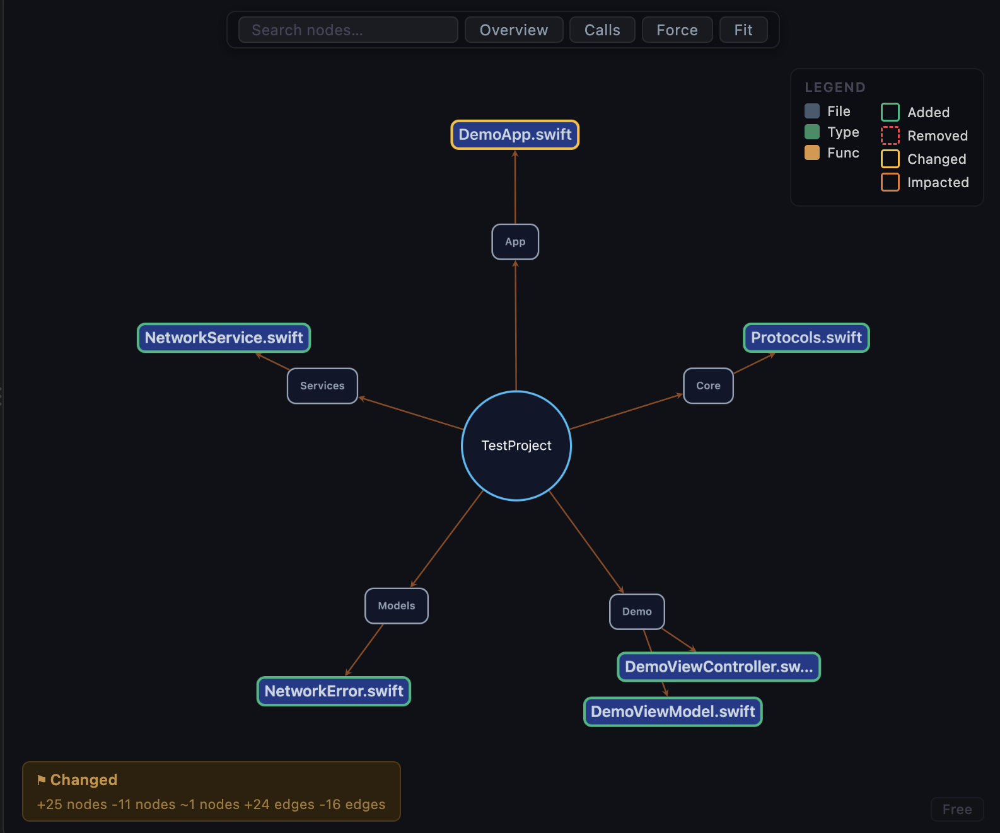
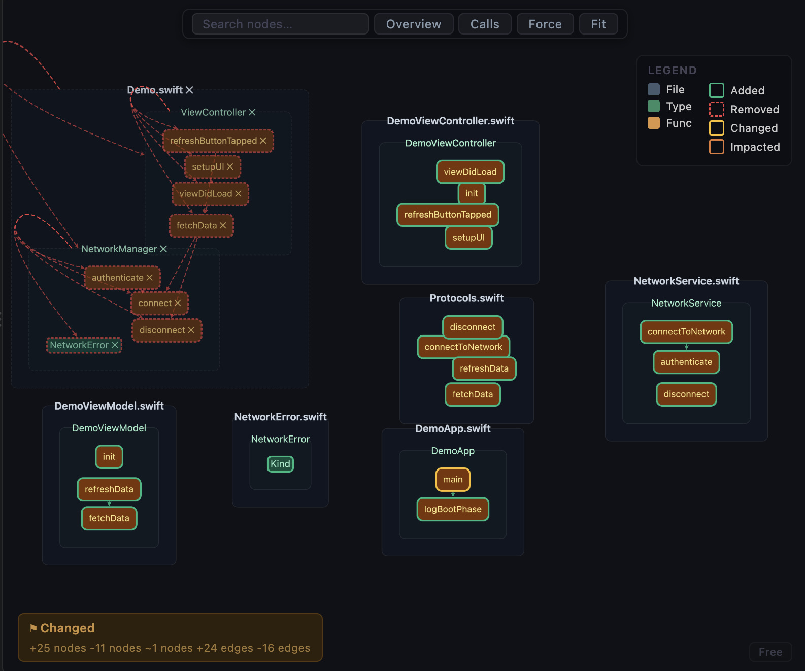
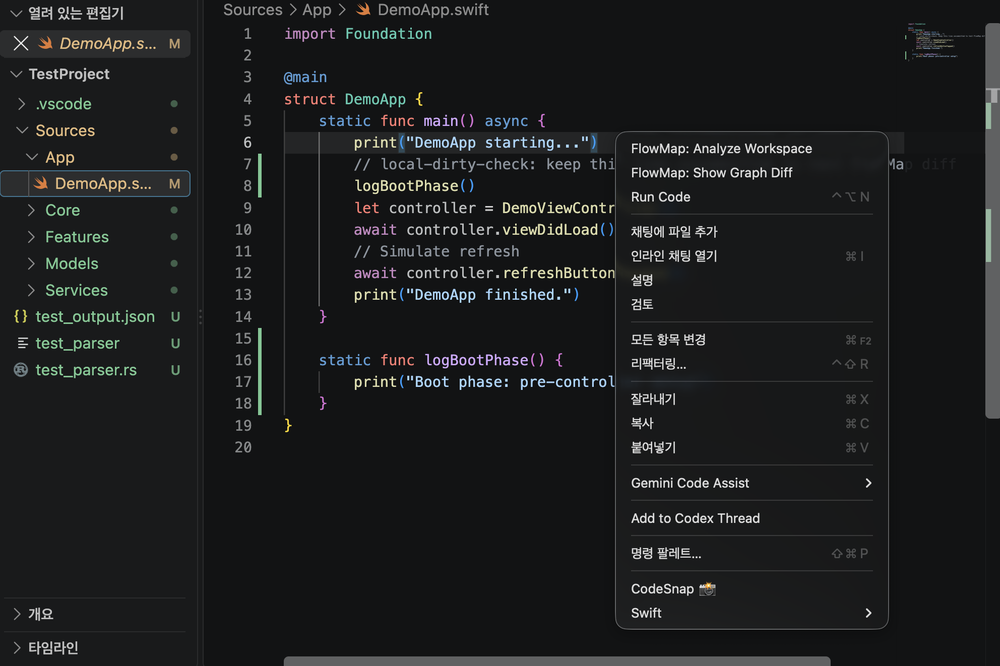

# FlowMap Hallucination Guard for Swift

**Public Beta**

FlowMap is a graph-based review tool for Swift projects. It helps you inspect AI-generated changes by showing the real structure of your code: files, types, functions, calls, graph diffs, and impacted nodes.

AI coding tools can produce changes that look plausible in a text diff while quietly breaking call relationships or moving logic into the wrong place. FlowMap adds a visual review layer so you can catch those structural mistakes faster.

Repository: https://github.com/adgk2349/FlowMap-AI_Code_Hallucination_Guard_for_Swift

Issues: https://github.com/adgk2349/FlowMap-AI_Code_Hallucination_Guard_for_Swift/issues

## What's New in 0.1.3

- Improved graph layout to reduce node overlap.
- Improved readability for dense Swift projects.
- Added right-click actions for analyzing Swift files and folders directly from VS Code.
- Added Marketplace screenshots for Overview, File Detail, and Calls views.
- Kept public beta positioning explicit: FlowMap is a review aid, not a compiler or test replacement.

## See the Code Shape Before You Trust the Change

FlowMap turns a Swift workspace into a visual graph. Use it when an AI assistant edits code and you want to verify whether the resulting structure still makes sense.

It highlights:

- Added nodes and edges.
- Removed nodes and edges.
- Changed functions.
- Impacted nodes reached through call relationships.
- File, type, function, and call-level structure.

## Overview Mode

Use Overview Mode to inspect the broad project shape. Folders and Swift files are grouped into a workspace-level graph, making unexpected file additions or large structural shifts easier to spot.

## File Detail Mode

Use File Detail Mode to inspect the inside of a Swift file. FlowMap groups types and functions so you can check whether an AI-generated edit changed the structure of a file in a suspicious way.

## Calls Mode

Use Calls Mode to trace function-level relationships across the workspace. The improved layout reduces overlap and keeps call paths easier to read, especially when reviewing changed or removed links.

## Faster VS Code Workflow

FlowMap can be launched from the command palette, and 0.1.3 also adds right-click entry points:

- Right-click a Swift file and run `FlowMap: Analyze Workspace`.
- Right-click a Swift file and run `FlowMap: Show Graph Diff`.
- Right-click a folder in Explorer and run `FlowMap: Analyze Workspace`.
- Save a Swift file to trigger auto-analysis when enabled.

## Quick Start

1. Install the extension.
2. Build the FlowMap engine from the GitHub repository.
3. Set `flowmap.binaryPath` to the built `flowmap` binary.
4. Open a Swift workspace in VS Code.
5. Run `FlowMap: Analyze Workspace`.
6. Open `FlowMap: Show Graph Diff`.

## Requirements

- macOS.
- Swift toolchain / Xcode Command Line Tools.
- A built FlowMap engine binary.

## Configuration

| Setting | Type | Default | Description |
| :--- | :--- | :--- | :--- |
| `flowmap.binaryPath` | `string` | `""` | Path to the `flowmap` analyzer binary. |
| `flowmap.autoAnalyzeOnSave` | `boolean` | `true` | Automatically re-analyze workspace when a Swift file is saved. |
| `flowmap.autoAnalyzeDebounceMs` | `number` | `500` | Delay in ms after save before triggering auto-analysis. |

## Public Beta Notes

FlowMap is not a compiler, type checker, or replacement for tests. It is a graph-based review aid for spotting suspicious structural changes faster.

Cross-file call resolution is intentionally conservative in the current beta. Protocols, extensions, and generic-heavy code may resolve to interface-level relationships instead of a single concrete implementation.
